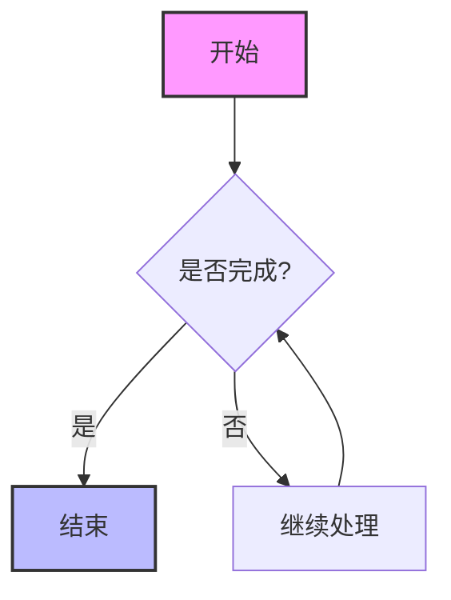
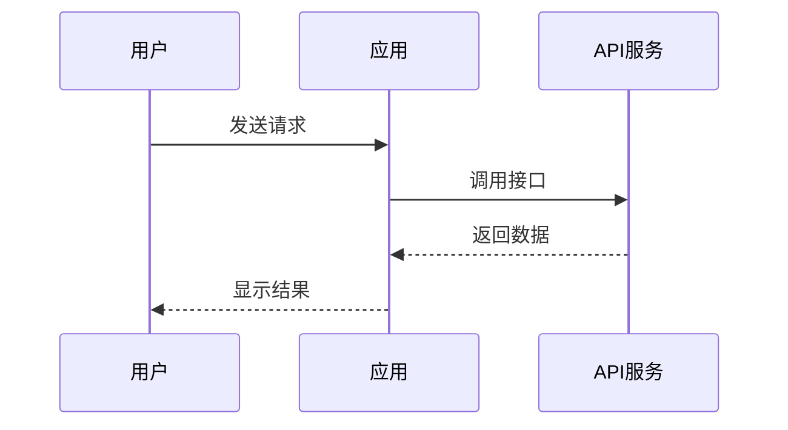
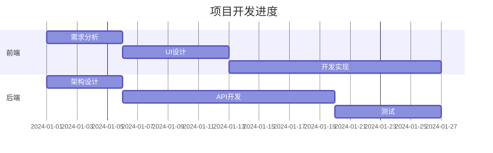
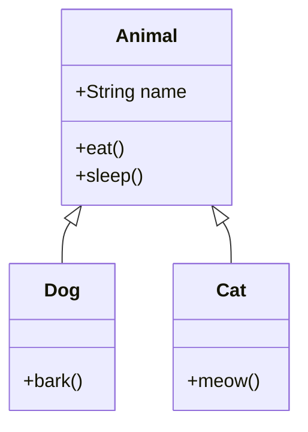
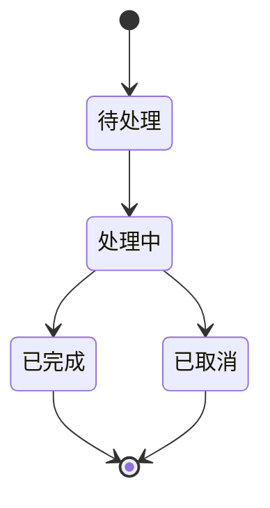
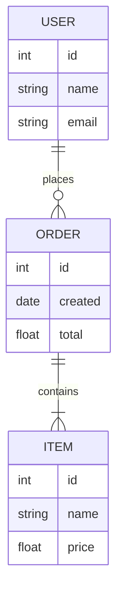
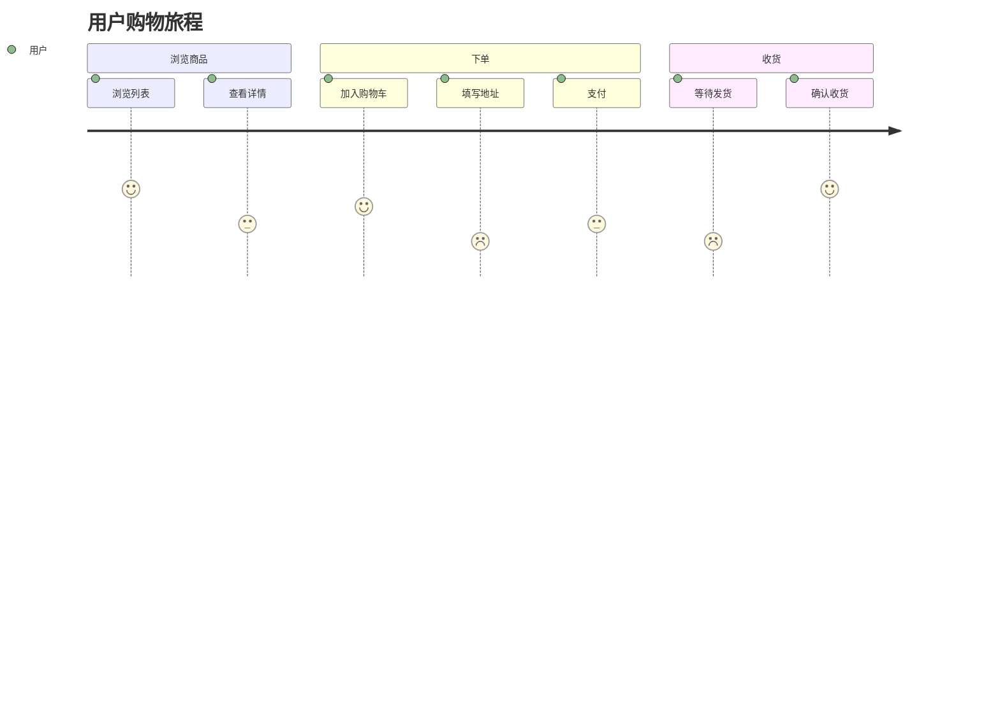
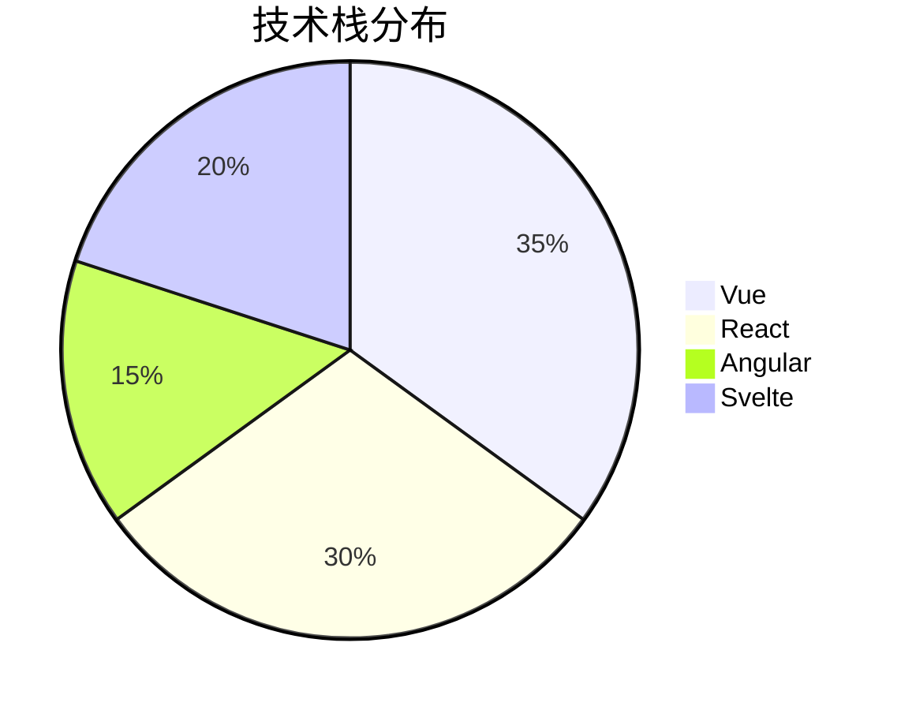

## Markdown 功能完整演示

### 1. 排版与样式 (Typography)
我们支持 **加粗文本**、*斜体强调*、~~删除线~~ 以及 `行内代码` 的混合排版。

> "海内存知己，天涯若比邻。"
>
> — *王勃《送杜少府之任蜀州》*

### 2. 列表系统 (Lists)
多级列表演示：
- **前端技术栈**
  - Vue 3 / Nuxt.js (推荐)
  - React / Next.js
  - SolidJS
- **后端技术栈**
  1. Spring Boot (Java)
  2. Gin (Go)
  3. FastAPI (Python)

**待办事项列表:**
- [x] 完成流式传输模块
- [x] 支持中文 Markdown 渲染
- [ ] 优化长文本渲染性能
- [ ] 增加多模态支持

### 3. 代码高亮 (Code Blocks)
测试不同语言的代码高亮显示效果。

**Go 语言示例:**
```go
package main

import "fmt"

func main() {
    messages := []string{"你好", "世界", "LLM"}
    for i, msg := range messages {
        fmt.Printf("索引: %d, 内容: %s\n", i, msg)
    }
}
```

**Vue 组件示例:**
```vue
<script setup lang="ts">
import { ref } from 'vue'
const count = ref(0)
</script>

<template>
  <button @click="count++">点击次数: {{ count }}</button>
</template>
```

### 4. 表格数据 (Tables)
展示复杂数据的对齐与展示。

| 模块名称 | 开发状态 | 负责人 | 优先级 |
| :--- | :---: | :---: | :---: |
| **核心引擎** | ✅ 已上线 | 张三 | P0 |
| **用户系统** | 🚧 开发中 | 李四 | P1 |
| **支付网关** | ❌ 待排期 | 王五 | P2 |

### 5. 数学公式 (LaTeX)
测试数学公式渲染能力。

**由于** $e^{i\pi} + 1 = 0$，我们知道这是数学中最优美的公式。

**高斯积分:**
$$
\int_{-\infty}^{\infty} e^{-x^2} dx = \sqrt{\pi}
$$

### 6. Mermaid 图表渲染
展示各种类型的 Mermaid 图表。

**流程图 (Flowchart):**


**时序图 (Sequence Diagram):**


**甘特图 (Gantt Chart):**


**类图 (Class Diagram):**


**状态图 (State Diagram):**


**ER 图 (Entity Relationship):**


**用户旅程图 (User Journey):**


**饼图 (Pie Chart):**


### 7. 图片渲染
测试 Markdown 图片的渲染效果。


带有描述文字的图片：


### 8. 长文本与古诗词
**《将进酒》 - 李白**

君不见黄河之水天上来，奔流到海不复回。
君不见高堂明镜悲白发，朝如青丝暮成雪。
人生得意须尽欢，莫使金樽空对月。
天生我材必有用，千金散尽还复来。
