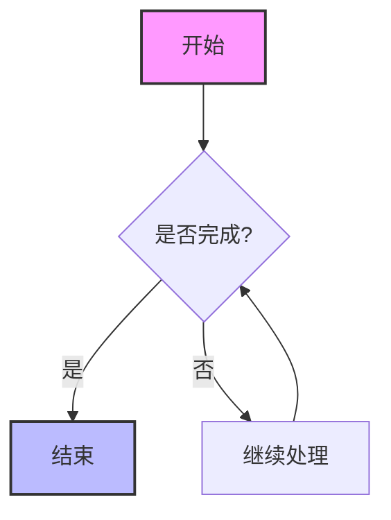
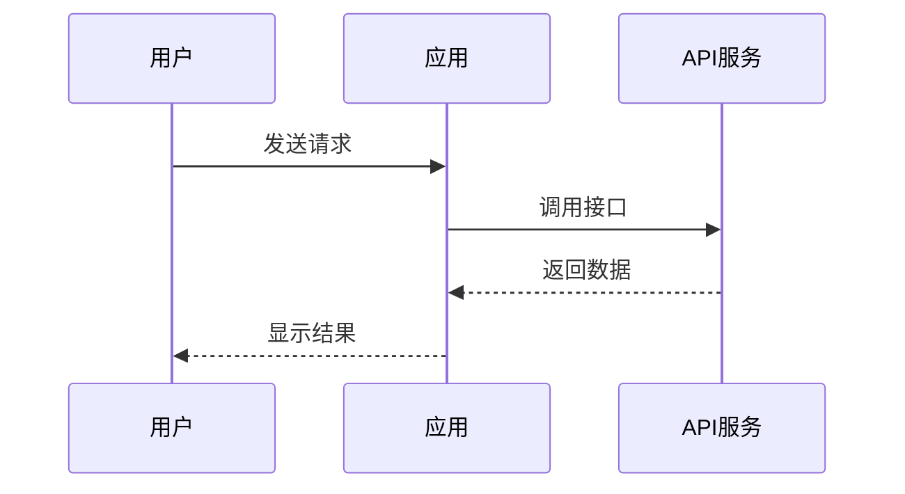
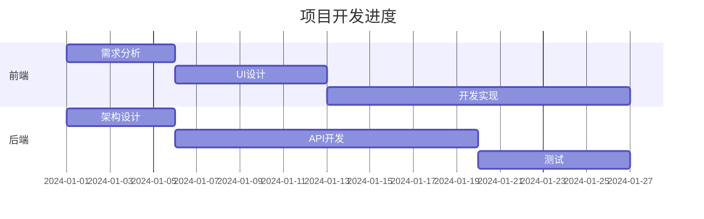
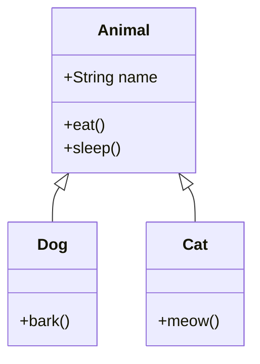
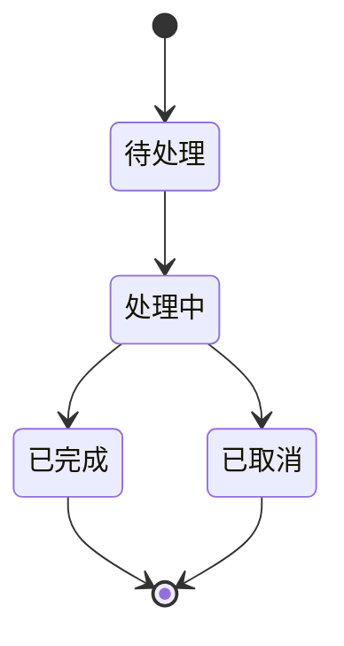
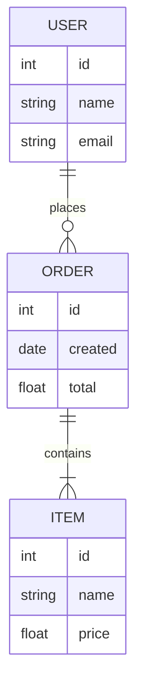
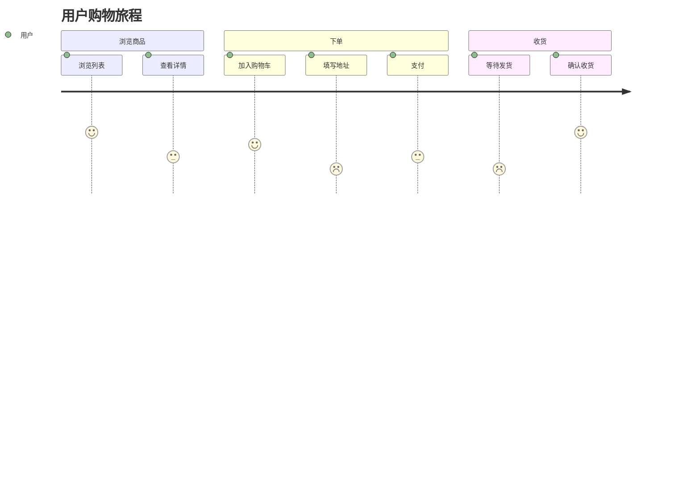
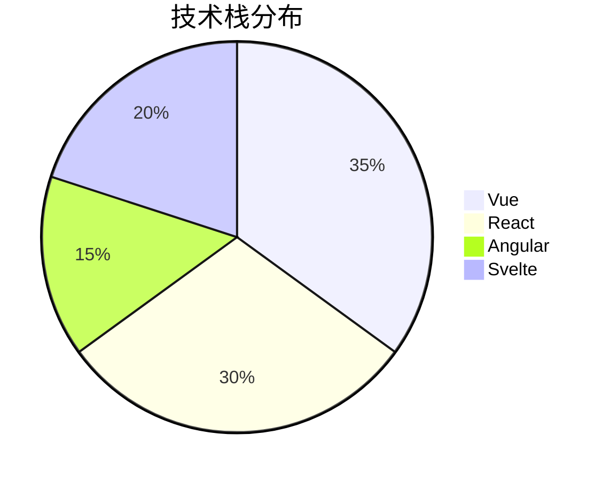

## Markdown Features Demo

### 1. Typography & Styles
We can support **bold text**, *italicized emphasis*, ~~strikethrough~~, and `inline code snippets`. 

> "Innovation distinguishes between a leader and a follower."
>
> — *Steve Jobs*

### 2. Structured Lists
Here is a nested list example:
- **Frontend Technologies**
  - Vue 3 / Nuxt
  - React / Next.js
  - Svelte
- **Backend Technologies**
  1. Node.js
  2. Python (FastAPI/Django)
  3. Go

**Task List:**
- [x] Implement Streaming
- [x] Support Markdown
- [ ] Optimize Performance
- [ ] Add Voice Input

### 3. Code Blocks
We need to ensure syntax highlighting works correctly for different languages.

**Python:**
```python
def fibonacci(n):
    if n <= 1:
        return n
    return fibonacci(n-1) + fibonacci(n-2)

print([fibonacci(i) for i in range(10)])
```

**TypeScript (Interface):**
```typescript
interface ChatMessage {
  id: string;
  role: 'user' | 'assistant';
  content: string;
  timestamp: number;
}
```

### 4. Tables
Data representation needs to be clear.

| Feature | Status | Priority |
| :--- | :---: | :---: |
| **Streaming** | ✅ Ready | High |
| **History** | 🚧 In Progress | Medium |
| **Plugins** | ❌ Pending | Low |

### 5. Mathematical Formulas (LaTeX)
Advanced chatbots simulate reasoning with math.

**Maxwell's Equations:**
$$
\nabla \times \mathbf{E} = -\frac{\partial \mathbf{B}}{\partial t}
$$

**Quadratic Formula:**
The solution is $x = \frac{-b \pm \sqrt{b^2 - 4ac}}{2a}$.

### 6. Mermaid 图表渲染
展示各种类型的 Mermaid 图表。

**流程图 (Flowchart):**


**时序图 (Sequence Diagram):**


**甘特图 (Gantt Chart):**


**类图 (Class Diagram):**


**状态图 (State Diagram):**


**ER 图 (Entity Relationship):**


**用户旅程图 (User Journey):**


**饼图 (Pie Chart):**


### 7. 图片渲染
测试 Markdown 图片的渲染效果。


带有描述文字的图片：


### 7. Long Content Testing
Lorem ipsum dolor sit amet, consectetur adipiscing elit. Sed do eiusmod tempor incididunt ut labore et dolore magna aliqua. Ut enim ad minim veniam, quis nostrud exercitation ullamco laboris nisi ut aliquip ex ea commodo consequat. 
