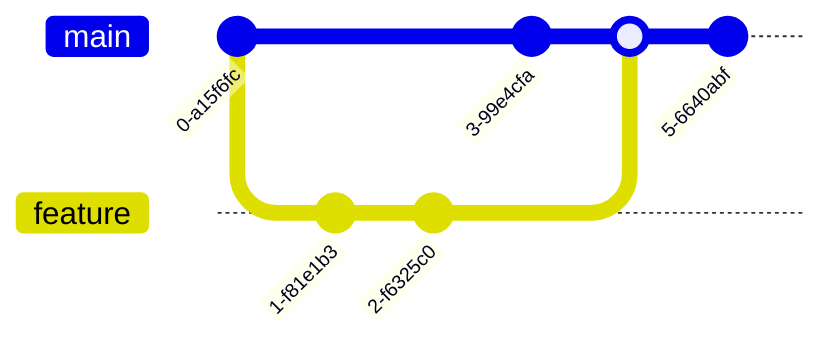

# Mermaid 图表完整展示

以下是各种类型的 Mermaid 图表示例：

## 1. 流程图 (Flowchart)
展示流程和控制逻辑。

## 2. 时序图 (Sequence Diagram)
展示对象之间的交互过程。

## 3. 甘特图 (Gantt Chart)
展示项目进度和时间规划。

## 4. 类图 (Class Diagram)
展示类的结构 and 关系。

## 5. 状态图 (State Diagram)
展示状态转换逻辑。

## 6. ER 图 (Entity Relationship)
展示实体关系模型。

## 7. 用户旅程图 (User Journey)
展示用户体验流程。

## 8. 饼图 (Pie Chart)
展示数据占比分布。

## 9. Git 图表 (Git Graph)
展示 Git 分支历史。

